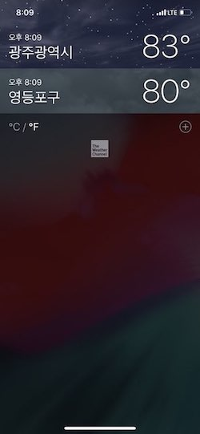
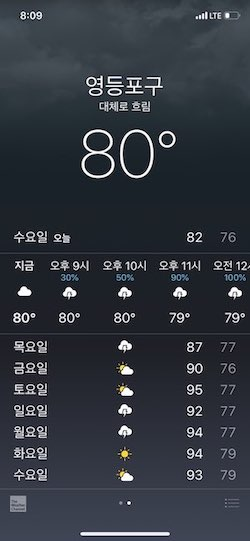

# WeatherForecast

## 요구사항 분석

### 필요화면

### 구현해야할 기능

- Networking
- Model & Parser
- API의 응답을 이용한 날씨 정보 화면 구현 검색 
- MapKit을 이용해서 도시명 검색
- MapKit을 통해 얻어낸 검색된 도시의 위/경도 좌표로 날씨 API 호출 검색된 도시정보를 앱 재시작 시, 반영될 수 있도록 구현 